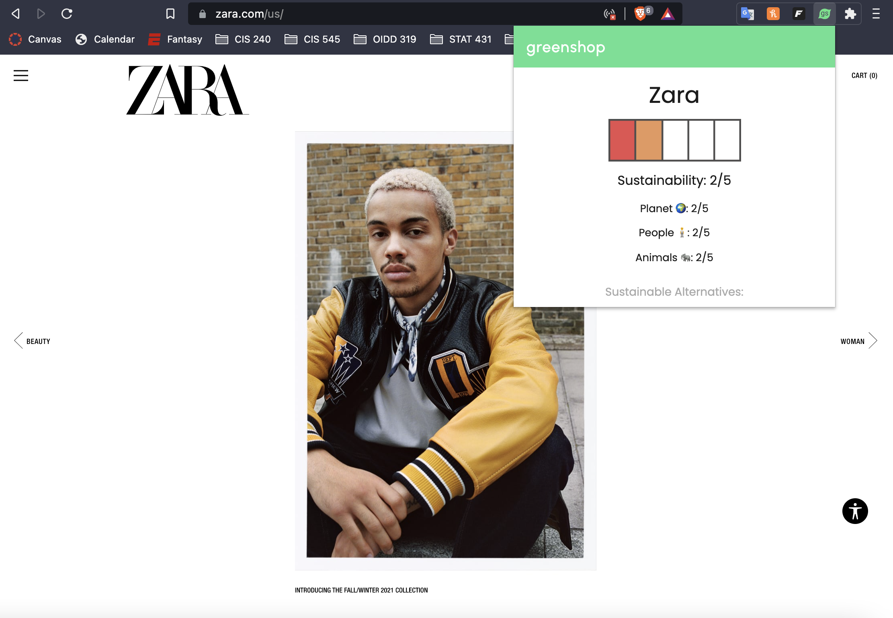
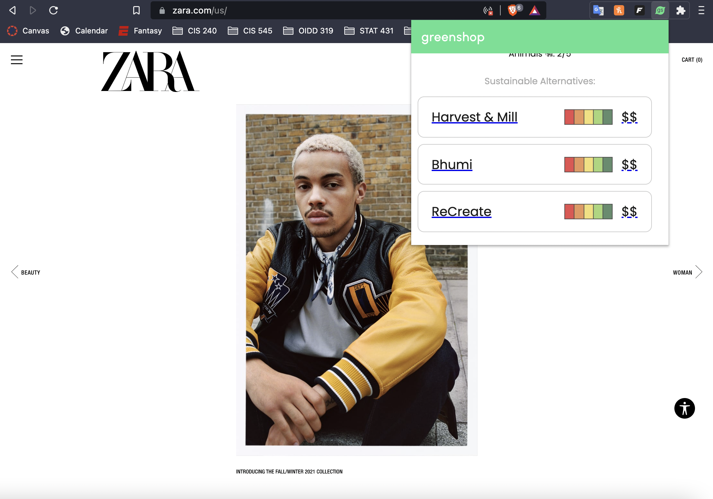

# greenshop

Greenshop is a chrome extension that tracks the user's online shopping and suggests sustainable alternatives based on price and brand sustainability rating.

<pre>

</pre>
* Check how sustainable your favorite stores are.

  

* Get recommendations for sustainable fashion store alternatives.

  

